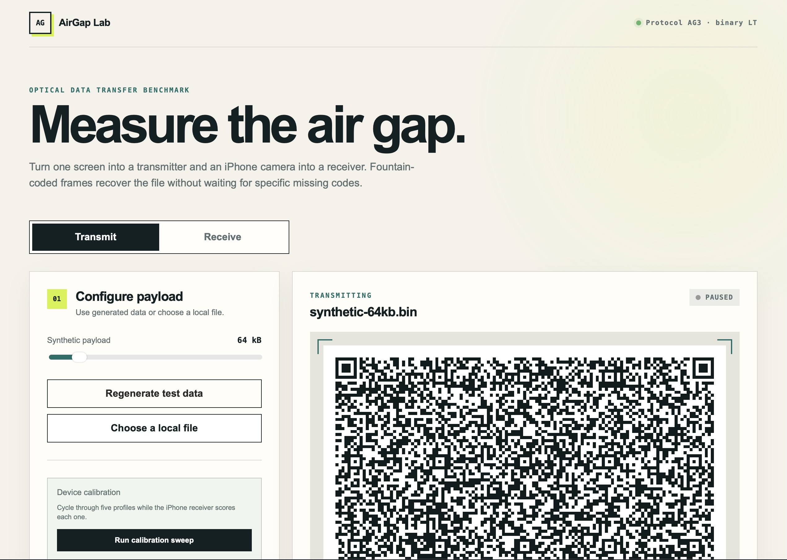

# AirGap Lab

AirGap Lab measures and demonstrates one-way file transfer through animated QR
codes. One device displays an endless fountain-coded stream while another uses
its camera to reconstruct and verify the original bytes.

The application is local-first. It has no account system, backend, analytics,
database, cloud API, or network transfer path for the payload.

<p align="center">
  
</p>

## Run locally

Requirements: Node.js 22.13 or newer.

```bash
npm install
npm run dev
```

Vite prints local and network HTTPS addresses. Open the local address on the
sending device. For an iPhone receiver, open the network address, accept the
self-signed development certificate, select **Receive**, and allow camera
access.

The page must be in a secure browser context for camera access. `localhost` is
treated as secure; another device connecting over the LAN needs HTTPS.

## Build one portable HTML file

```bash
npm run build
```

The result is `dist/index.html`. It contains the application JavaScript, CSS,
QR encoder, decoder worker, and ZXing WebAssembly binary—there are no companion
runtime files or CDN dependencies.

You can open the file directly for transmitting. Browser security normally
blocks camera access from `file://`, so receiving should use an HTTPS server:

```bash
npm run preview
```

The single HTML file can also be copied to any static HTTPS web server.

## Test

```bash
npm test
```

Tests verify the standalone artifact shape, protocol features, and recovery of
a payload with simulated dropped and duplicate fountain frames.

## Optical pipeline

- Raw binary QR byte mode with a compact 20-byte frame header
- Deterministic robust-soliton LT fountain coding
- ZXing C++/WebAssembly decoding in two inline workers
- Camera delivery driven by `requestVideoFrameCallback` when available
- Fixed QR mask, integer scaling, and queued sender frames
- Calibration sweep from conservative to maximum-density profiles
- Reconstructed-byte verification before download

AirGap Lab does not create a radio or network data channel between sender and
receiver. A network connection may be used only to load the page; the selected
payload itself travels through the screen and camera.

## Acknowledgements

The fountain-coding core of this project is adapted from
[Decimen Optical Transfer](https://github.com/bashalarmistalt/decimen-optical-transfer)
by BashAlarmist, used under the MIT License. Thank you.

That project worked out a materially better approach to the speed-limiting part
of an optical link than we had: a deterministic robust-soliton LT construction
where the degree distribution is reproducible bit-for-bit across JavaScript
engines. That determinism is what lets the sender fire frames blind at full
rate, with no handshake, no back-channel, and no retransmission — a dropped
frame costs a little time rather than correctness. It is the difference between
a demo and something that actually sustains throughput.

`app/optical/fountain.ts` and `app/optical/protocol.ts` are derived from that
work. Full attribution and the upstream license are in
[THIRD-PARTY-NOTICES.md](THIRD-PARTY-NOTICES.md).
